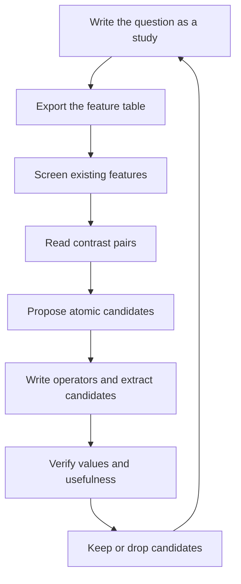

# Proposing and verifying features

A feature earns its place when it differs between groups the user compares, or when it explains which trajectories succeed after those groups are held fixed. Follow one loop:



Follow the `traj-features` skill when writing an operator. The files under `studies/` are analysis specifications for the workflow below, not inputs consumed by `traj`.

## 1. Write the question as a study

Store the question in `studies/<name>.yaml` so later rounds use the same population and outcome:

| Field | Meaning |
|---|---|
| `description` | question in one sentence |
| `where` | optional pandas query selecting the relevant population |
| `target` | pandas expression that is true for successful trajectories |
| `by` | columns to hold fixed during comparisons, such as model and case id |
| `outcomes` | features that encode the target or evaluation result; never propose them as explanations |
| `pairs.within` | column both trajectories in a contrast pair must share |
| `pairs.distinct` | optional column the two trajectories should differ on |
| `pairs.n` | number of pairs to inspect |

Split a staged outcome into separate studies. For example, first study whether the agent queried a true root-cause service, then whether it submitted that service, then whether it named the fault kind.

Columns named by a study must be enabled features. Metadata such as model and case id becomes a feature through `meta.fields`. Validate all project configuration by running:

```bash
traj extract --dry-run --limit 1
```

## 2. Export and screen existing features

Export the current query table after extracting the required groups:

```bash
traj extract
traj table > .traj/table.csv
```

Use pandas to inspect target balance, missingness, numeric correlations and categorical target rates. Replace `STUDY` with the study name:

```bash
STUDY=service_choice python - <<'PY'
import os
import pandas as pd
from ruamel.yaml import YAML

spec = YAML(typ="safe").load(open(f"studies/{os.environ['STUDY']}.yaml"))
frame = pd.read_csv(".traj/table.csv", index_col=0)
if spec.get("where"):
    frame = frame.query(spec["where"])
target = frame.eval(spec["target"]).astype(float).rename("target")
excluded = set(spec.get("outcomes", [])) | set(spec.get("by", []))
print("population", len(frame), "target_rate", round(target.mean(), 4))
print("\nmissing share")
print(frame.isna().mean().sort_values(ascending=False).head(30).to_string())
numeric = frame.select_dtypes(include="number").drop(columns=list(excluded), errors="ignore")
print("\nnumeric correlation with target")
print(numeric.corrwith(target).abs().sort_values(ascending=False).head(30).to_string())
for column in frame.select_dtypes(exclude="number").columns:
    if column not in excluded and frame[column].nunique(dropna=True) <= 20:
        print(f"\n{column}")
        print(pd.DataFrame({column: frame[column], "target": target}).groupby(column).target.agg(["mean", "size"]).to_string())
PY
```

Treat this as a screen, not causal evidence. Drop constants, near-empty features and obvious duplicates. A feature that directly restates `target` belongs in `outcomes`, not in the candidate list.

## 3. Build and read contrast pairs

Pair a successful trajectory with a failed trajectory that shares `pairs.within`. Prefer different values of `pairs.distinct` when specified:

```bash
STUDY=service_choice python - <<'PY'
import os
import pandas as pd
from ruamel.yaml import YAML

spec = YAML(typ="safe").load(open(f"studies/{os.environ['STUDY']}.yaml"))
frame = pd.read_csv(".traj/table.csv", index_col=0)
if spec.get("where"):
    frame = frame.query(spec["where"])
frame = frame.assign(_target=frame.eval(spec["target"]).astype(bool))
pairs = spec["pairs"]
found = []
for value, group in frame.groupby(pairs["within"], dropna=False):
    yes, no = group[group._target], group[~group._target]
    for success_key, success in yes.iterrows():
        candidates = no
        distinct = pairs.get("distinct")
        if distinct and distinct in group and pd.notna(success[distinct]):
            preferred = no[no[distinct].ne(success[distinct])]
            if not preferred.empty:
                candidates = preferred
        if not candidates.empty:
            found.append((value, success_key, candidates.index[0]))
            break
    if len(found) >= pairs.get("n", 5):
        break
for within, success, failure in found:
    print(f"{within}\tsuccess={success}\tfailure={failure}")
    for key in (success, failure):
        dataset, trajectory_id = key.split("/", 1)
        print(f"  .traj/datasets/{dataset}/{trajectory_id}.md")
PY
```

Read both Markdown files in every pair. Find the first relevant divergence and record both trajectory keys and step numbers. When delegating several studies, give each subagent one study, its pairs and the existing feature list.

## 4. Propose and extract atomic candidates

Turn each observed divergence into atomic features. Prefer code features for structured fields and LLM features for statements written by the agent or user. Every candidate must cite the contrast that motivated it and must not restate the target or an existing feature.

Write operators under `operators/<namespace>/`, enable them, and inspect their definitions:

```bash
traj operators show <operator>
traj extract --group <group> --key <dataset/id> --key <dataset/id>
```

Put new LLM candidates in their own call group until their values are verified. Use `traj extract --group <group> --dry-run` to see cached and pending work before a full extraction.

## 5. Verify values

For code candidates, inspect selected rows in `.traj/features/<group>.parquet` and compare them with the corresponding Markdown and unified JSON files.

For LLM candidates, ask a careful reader who did not propose the features to answer each candidate from Markdown alone. Save answers as `reference.json`:

```json
{"ops-lite/example": {"agent_notes_missing_data": true}}
```

Compare scalar, boolean and category answers with the extracted Parquet group:

```bash
GROUP=rca_extract python - <<'PY'
import json
import os
import pandas as pd

reference = json.load(open("reference.json"))
actual = pd.read_parquet(f".traj/features/{os.environ['GROUP']}.parquet").set_index("key")
for feature in sorted({name for answers in reference.values() for name in answers}):
    rows = [(key, answers[feature], actual.at[key, feature]) for key, answers in reference.items()
            if feature in answers and key in actual.index]
    matches = [expected == observed for _, expected, observed in rows]
    print(feature, f"{sum(matches)}/{len(matches)}")
    for match, (key, expected, observed) in zip(matches, rows):
        if not match:
            evidence = actual.at[key, f"{feature}__evidence"] if f"{feature}__evidence" in actual else None
            print(" ", key, "expected=", expected, "actual=", observed, "evidence=", evidence)
PY
```

For set features, normalize both values to sets and compare Jaccard similarity instead of direct equality. Rewrite or split questions that need judgement or disagree often.

## 6. Verify usefulness and retain changes

After values are accurate, extract the candidate group across the population, export `.traj/table.csv` again and repeat the screen in section 2. Check the candidate within each important `by` group rather than relying only on a global correlation.

Disable candidates that are constant, redundant, inaccurate or unrelated to the study:

```bash
traj operators disable <operator-or-instance>
```

Keep the study, retained operators and sampler changes together. Leave changes uncommitted when the user wants to review them first.

## Without an outcome

When no success criterion exists, sample a diverse and unusual review set:

```bash
traj sample --sampler default --budget 20
```

Read every Markdown path in the returned `picks`. Record how the trajectories differ; those differences suggest candidate features and possible outcomes for a later study.
